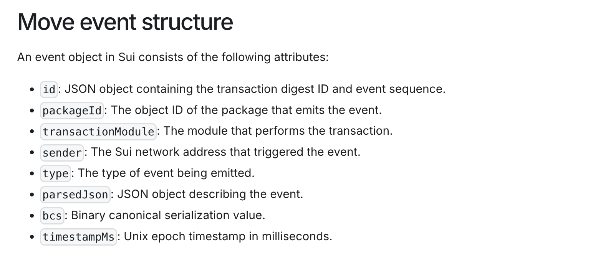
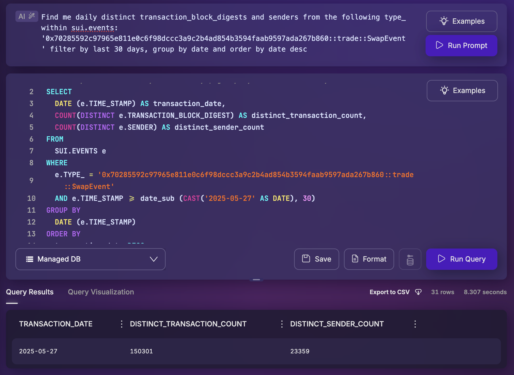

📦 How Sui Blockchain Data is Structured in Space and Time
_______________________________________________________

This directory contains a collection of prompts and SQL templates I use to query and analyze data on the Sui blockchain using Space and Time. It’s built to help you quickly find what’s happening onchain without needing to know any programming, coding or SQL. For more detailed information regarding the Sui blockchain, or move programming language, find the links at the bottom.

## 📁 What’s in this directory?

This folder contains:
- Reusable prompts for **no-code SQL**
- Raw SQL queries for advanced users
- Output samples and insights based on real Sui data

---

## 🧠 Core Tables You Will Be Working With:

| Table | Description |
|-------|-------------|
| **`sui.events`** | Emitted logs from smart contracts — track on-chain activity like swaps, mints, or burns. |
| **`sui.move_calls`** | Every Move function call executed on-chain — shows user intent and protocol interaction. |
| **`sui.balance_changes`** | Token transfers and changes in balance for any transaction — essential for tracking value flow. |

## 🔍 How These Tables Work Together

To understand what happens in a Sui transaction, you’ll usually combine all three tables — sui.events, sui.move_calls, and sui.balance_changes.

Each object has an owner, and ownership can fall into a few categories. The most common and relevant one when querying a user transactions is **address-owned**.

Space and Time's sui.events table offers a much more structured and readable format out of the box. Each event in Sui includes a fully qualified type_ field (e.g., package::module::Event<T>) containing the protocol, module, and action that occurred. Unlike Ethereum (EVM), where querying onchain actions starts with decoding raw logs from the logs table, is indexed by topic hash and requires an ABI.

# Prompt Example

**Find me daily distinct transaction_block_digests and senders from the following type_ within sui.events:'0x70285592c97965e811e0c6f98dccc3a9c2b4ad854b3594faab9597ada267b860::trade::SwapEvent' filter by last 30 days, group by date and order by date desc**

The prompt above requests for 30 day transactions and senders within Sui DEX Momentum Finance's CLMM module type_ within the Sui blockchain. When typing your prompt, make sure to include the exact tables and columns needed. Space and Time's No-Code SQL tool (AKA Houston) has full knowledge of all tables within the SxT platform. 

### Prompt Result

The query for the prompt above generated 30d transactions and senders on momentum finance, finalized in < 8s (Whoa).

## 🔗 Resources

**[Sui Blockchain Explorer](https://suivision.xyz/)**

**[Sui Developer Docs](https://docs.sui.io/)**

**[Sui Table Reference](https://docs.spaceandtime.io/docs/sui-schema-overview)**

## 💡 Tips for Better Prompts

- Always include a date range or use relative time like “last 30 days.”

- Use fully-qualified type_ strings to pinpoint contract events.

- Specify joins explicitly: mention which tables and fields should be linked.

- Say “divide amount by 1e8” if the token has 8 decimals.

- Use grouping logic like "group by day" to structure output.